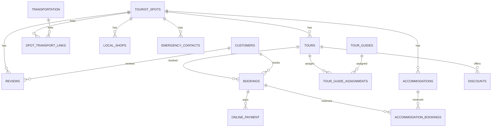

# **Tourism Database Project: Tour Underrated Places in Bangladesh at Low Cost**

## **1. Project Description**

The "Tourism Database Project: Tour Underrated Places in Bangladesh at Low Cost" aims to organize information about underrated tourist spots in Bangladesh. The project is designed to help travel agencies, tour operators, and individual tourists efficiently plan trips at a lower cost while exploring unique destinations. The database includes data about tourist spots, tours, tour guides, customers, bookings, transportation, and discounts. It also incorporates efficient payment and emergency management systems.

The database is built with a relational schema to enable seamless management of interconnected data, ensuring data integrity and consistency.

**Tables :**
-	Tourist_Spots
-	Tours
-	Tour_Guides
-	Tour_Guide_Assignments
-	Customers
-	Bookings
-	Reviews
-	Transportation
-	Spot_Transport_Links
-	Discounts
-	Local_Shops
-	Emergency_Contacts
-	Online_Payment
-	Accommodations
-	Accommodation_Bookings

---

## Entity Relationship Diagram
The Entity-Relationship (ER) Diagram below visualizes the relationships between the entities in the TourismDB project. Each entity represents a table, and the relationships between them are defined using primary and foreign keys.

### Entities:
- **Tourist_Spots**: Represents the tourist spots with information like name, description, location, entry fees, and best time to visit.
- **Tours**: Contains details about tours, including tour name, spot ID, tour fee, and duration.
- **Tour_Guides**: Stores information about guides, including their names, contact info, language skills, and experience.
- **Tour_Guide_Assignments**: Links tours to their assigned guides.
- **Customers**: Includes customer details like name, contact info, and preferred language.
- **Bookings**: Stores booking details like booking date, cost, customer ID, and tour ID.
- **Reviews**: Allows customers to provide reviews and ratings for tourist spots.
- **Transportation**: Provides details about available transportation, costs, and availability.
- **Spot_Transport_Links**: Links transportation options to specific tourist spots.
- **Discounts**: Contains information about discounts available for specific tours.
- **Local_Shops**: Lists shops near tourist spots and their offerings.
- **Emergency_Contacts**: Stores emergency contact details for each spot.
- **Online_Payment**: Handles payment information for bookings.

---


## OVERView

A normalized, scalable, and well-structured schema for a tourism information and booking system, designed for high data integrity and extensibility.

---

## 1. `TOURIST_SPOTS`

**Stores information about tourist attractions (e.g., parks, museums, landmarks).**

| Attribute              | Type                   | Constraints                   | Description                               |
|------------------------|------------------------|-------------------------------|-------------------------------------------|
| Spot_ID                | INT                    | PK, IDENTITY                  | Unique identifier for each spot           |
| Spot_Name              | NVARCHAR(100)          | NOT NULL                      | Name of the tourist spot                  |
| Location               | NVARCHAR(100)          | NOT NULL                      | Address or geographic location            |
| Description            | NVARCHAR(MAX)          |                               | Detailed description                      |
| Entry_Fee              | DECIMAL(10,2)          | DEFAULT 0.00                  | Entry fee                                 |
| Best_Time_to_Visit     | NVARCHAR(50)           | NOT NULL                      | Recommended visit season/time             |

**Normalization:** 3NF  
**Relations:**  
- 1:N → Tours, Reviews, Spot_Transport_Links, Local_Shops, Emergency_Contacts, Accommodations  

---

## 2. `TOURS`

**Details of available tours, each linked to a specific tourist spot.**

| Attribute      | Type             | Constraints          | Description                  |
|----------------|------------------|----------------------|------------------------------|
| Tour_ID        | INT              | PK, IDENTITY         | Unique tour identifier       |
| Tour_Name      | NVARCHAR(100)    | NOT NULL             | Name of the tour             |
| Spot_ID        | INT              | FK, NOT NULL         | Linked tourist spot          |
| Tour_Fee       | DECIMAL(10,2)    | DEFAULT 0.00         | Fee for the tour             |
| Duration       | NVARCHAR(50)     | NOT NULL             | Duration/length of the tour  |

**Normalization:** 3NF  
**Relations:**  
- N:1 → Tourist_Spots  
- 1:N → Tour_Guide_Assignments, Bookings, Discounts  

---

## 3. `TOUR_GUIDES`

**Information about available tour guides.**

| Attribute        | Type             | Constraints                | Description                |
|------------------|------------------|----------------------------|----------------------------|
| Guide_ID         | INT              | PK, IDENTITY               | Unique guide identifier    |
| Guide_Name       | NVARCHAR(100)    | NOT NULL                   | Name of the guide          |
| Contact_Info     | NVARCHAR(100)    | UNIQUE                     | Contact details            |
| Language_Skills  | NVARCHAR(100)    | NOT NULL                   | Languages spoken           |
| Experience_Years | INT              | CHECK (>= 0)               | Years of experience        |

**Normalization:** 3NF  
**Relations:**  
- 1:N → Tour_Guide_Assignments  

---

## 4. `TOUR_GUIDE_ASSIGNMENTS`

**Assigns guides to specific tours.**

| Attribute      | Type    | Constraints          | Description                |
|----------------|---------|----------------------|----------------------------|
| Assignment_ID  | INT     | PK, IDENTITY         | Unique assignment record   |
| Tour_ID        | INT     | FK, NOT NULL         | Linked tour                |
| Guide_ID       | INT     | FK, NOT NULL         | Linked guide               |

**Normalization:** 3NF  
**Relations:**  
- N:1 → Tours, Tour_Guides  

---

## 5. `CUSTOMERS`

**Stores customer information for bookings and reviews.**

| Attribute          | Type             | Constraints           | Description                  |
|--------------------|------------------|-----------------------|------------------------------|
| Customer_ID        | INT              | PK, IDENTITY          | Unique customer ID           |
| Customer_Name      | NVARCHAR(100)    | NOT NULL              | Name of the customer         |
| Contact_Info       | NVARCHAR(100)    | UNIQUE                | Contact information          |
| Preferred_Language | NVARCHAR(50)     |                       | Language preference          |

**Normalization:** 3NF  
**Relations:**  
- 1:N → Bookings, Reviews  

---

## 6. `BOOKINGS`

**Records bookings of tours by customers.**

| Attribute      | Type             | Constraints           | Description              |
|----------------|------------------|-----------------------|--------------------------|
| Booking_ID     | INT              | PK, IDENTITY          | Unique booking ID        |
| Customer_ID    | INT              | FK, NOT NULL          | Customer                 |
| Tour_ID        | INT              | FK, NOT NULL          | Tour booked              |
| Booking_Date   | DATE             | NOT NULL              | Date of booking          |
| Total_Cost     | DECIMAL(10,2)    | DEFAULT 0.00          | Total cost               |

**Normalization:** 3NF  
**Relations:**  
- N:1 → Customers, Tours  
- 1:N → Online_Payment, Accommodation_Bookings  

---

## 7. `REVIEWS`

**Customer reviews for tourist spots.**

| Attribute      | Type             | Constraints           | Description                      |
|----------------|------------------|-----------------------|----------------------------------|
| Review_ID      | INT              | PK, IDENTITY          | Unique review ID                 |
| Spot_ID        | INT              | FK, NOT NULL          | Reviewed spot                    |
| Customer_ID    | INT              | FK, NOT NULL          | Reviewer                         |
| Review_Text    | NVARCHAR(MAX)    |                       | Review details                   |
| Rating         | INT              | CHECK (1-5)           | Rating score                     |

**Normalization:** 3NF  
**Relations:**  
- N:1 → Tourist_Spots, Customers  

---

## 8. `TRANSPORTATION`

**Available transportation types.**

| Attribute      | Type            | Constraints          | Description                |
|----------------|-----------------|----------------------|----------------------------|
| Transport_ID   | INT             | PK, IDENTITY         | Unique transport ID        |
| Transport_Type | NVARCHAR(50)    | NOT NULL             | Type (e.g., bus, taxi)     |
| Cost_Per_Trip  | DECIMAL(10,2)   | DEFAULT 0.00         | Trip cost                  |
| Availability   | NVARCHAR(50)    | NOT NULL             | Availability status        |

**Normalization:** 3NF  
**Relations:**  
- 1:N → Spot_Transport_Links  

---

## 9. `SPOT_TRANSPORT_LINKS`

**Links tourist spots to available transportation.**

| Attribute      | Type             | Constraints           | Description                      |
|----------------|------------------|-----------------------|----------------------------------|
| Link_ID        | INT              | PK, IDENTITY          | Unique link ID                   |
| Spot_ID        | INT              | FK, NOT NULL          | Linked spot                      |
| Transport_ID   | INT              | FK, NOT NULL          | Linked transportation            |
| Comments       | NVARCHAR(MAX)    |                       | Additional notes                 |

**Normalization:** 3NF  
**Relations:**  
- N:1 → Tourist_Spots, Transportation  

---

## 10. `DISCOUNTS`

**Discount offers on tours.**

| Attribute           | Type             | Constraints             | Description                     |
|---------------------|------------------|-------------------------|---------------------------------|
| Discount_ID         | INT              | PK, IDENTITY            | Unique discount ID              |
| Tour_ID             | INT              | FK, NOT NULL            | Tour receiving discount         |
| Discount_Percentage | DECIMAL(5,2)     | CHECK (0-100)           | Discount percent                |
| Start_Date          | DATE             | NOT NULL                | Start date                      |
| End_Date            | DATE             | NOT NULL                | End date                        |

**Normalization:** 3NF  
**Relations:**  
- N:1 → Tours  

---

## 11. `LOCAL_SHOPS`

**Information about local shops near tourist spots.**

| Attribute      | Type             | Constraints           | Description                      |
|----------------|------------------|-----------------------|----------------------------------|
| Shop_ID        | INT              | PK, IDENTITY          | Unique shop ID                   |
| Shop_Name      | NVARCHAR(100)    | NOT NULL              | Shop name                        |
| Spot_ID        | INT              | FK, NOT NULL          | Linked spot                      |
| Product_Type   | NVARCHAR(100)    |                       | Type of products sold            |

**Normalization:** 3NF  
**Relations:**  
- N:1 → Tourist_Spots  

---

## 12. `EMERGENCY_CONTACTS`

**Emergency contacts at tourist spots.**

| Attribute      | Type             | Constraints           | Description                      |
|----------------|------------------|-----------------------|----------------------------------|
| Contact_ID     | INT              | PK, IDENTITY          | Unique contact ID                |
| Spot_ID        | INT              | FK, NOT NULL          | Linked spot                      |
| Contact_Type   | NVARCHAR(50)     | NOT NULL              | Type (e.g., police, medical)     |
| Contact_Number | NVARCHAR(20)     | UNIQUE                | Contact number                   |

**Normalization:** 3NF  
**Relations:**  
- N:1 → Tourist_Spots  

---

## 13. `ONLINE_PAYMENT`

**Tracks online payments for bookings.**

| Attribute       | Type             | Constraints           | Description                      |
|-----------------|------------------|-----------------------|----------------------------------|
| Payment_ID      | INT              | PK, IDENTITY          | Unique payment ID                |
| Booking_ID      | INT              | FK, NOT NULL          | Linked booking                   |
| Payment_Date    | DATE             | NOT NULL              | Date of payment                  |
| Payment_Amount  | DECIMAL(10,2)    | NOT NULL              | Amount paid                      |
| Payment_Method  | NVARCHAR(50)     | NOT NULL              | Method (e.g., card, PayPal)      |
| Payment_Status  | NVARCHAR(50)     | NOT NULL              | Status (e.g., completed)         |

**Normalization:** 3NF  
**Relations:**  
- N:1 → Bookings  

---

## 14. `ACCOMMODATIONS`

**Accommodation options at or near tourist spots.**

| Attribute            | Type             | Constraints           | Description                      |
|----------------------|------------------|-----------------------|----------------------------------|
| Accommodation_ID     | INT              | PK, IDENTITY          | Unique accommodation ID          |
| Accommodation_Name   | NVARCHAR(100)    | NOT NULL              | Name                             |
| Spot_ID              | INT              | FK, NOT NULL          | Linked spot                      |
| Type                 | NVARCHAR(50)     | NOT NULL              | Accommodation type               |
| Address              | NVARCHAR(200)    |                       | Address                          |
| Price_Per_Night      | DECIMAL(10,2)    | NOT NULL              | Price per night                  |
| Contact_Number       | NVARCHAR(20)     |                       | Contact info                     |

**Normalization:** 3NF  
**Relations:**  
- N:1 → Tourist_Spots  
- 1:N → Accommodation_Bookings  

---

## 15. `ACCOMMODATION_BOOKINGS`

**Links customer bookings to accommodations.**

| Attribute                | Type             | Constraints           | Description                      |
|--------------------------|------------------|-----------------------|----------------------------------|
| Accommodation_Booking_ID | INT              | PK, IDENTITY          | Unique record                    |
| Booking_ID               | INT              | FK, NOT NULL          | Linked booking                   |
| Accommodation_ID         | INT              | FK, NOT NULL          | Linked accommodation             |
| Check_In                 | DATE             | NOT NULL              | Check-in date                    |
| Check_Out                | DATE             | NOT NULL              | Check-out date                   |
| Total_Nights             | INT              | NOT NULL              | Number of nights                 |
| Total_Cost               | DECIMAL(10,2)    | NOT NULL              | Total cost                       |

**Normalization:** 3NF  
**Relations:**  
- N:1 → Bookings  
- N:1 → Accommodations  

---

## Entity Relationship Diagram (ERD) Overview




## ER Diagram


## Schema Diagram

The schema diagram illustrates the implementation of the database from the ER diagram. It shows the tables, their attributes, and the relationships between them, including primary keys (PK) and foreign keys (FK).

### Schema Features:
- **Primary Key Constraints**: Ensure each table has a unique identifier.
- **Foreign Key Constraints**: Maintain relationships between tables.
- **Default Values and Checks**: Ensure data integrity (e.g., non-negative experience years, valid ratings, etc.).
- **Cascading Deletes**: Automatically remove dependent records when a parent record is deleted.


---

# SQL Queries and Results

---

## 1. 🏞️ List All Tourist Spots with Their Entry Fees

```sql
SELECT Spot_Name, Location, Entry_Fee
FROM Tourist_Spots
ORDER BY Spot_Name;
```

**Result:**


---

## 2. 🚐 Show All Tours and Their Related Tourist Spot
```sql
SELECT T.Tour_Name, S.Spot_Name, T.Tour_Fee, T.Duration
FROM Tours T
JOIN Tourist_Spots S ON T.Spot_ID = S.Spot_ID;
```

**Result:**


## 3. 🧑‍💼 Find All Available Guides and Their Experience

```sql
SELECT Guide_Name, Language_Skills, Experience_Years
FROM Tour_Guides;
```

**Result:**


---

## 4. 🗂️ See Which Guide Is Assigned to Which Tour

```sql
SELECT TG.Guide_Name, T.Tour_Name
FROM Tour_Guide_Assignments GA
JOIN Tour_Guides TG ON GA.Guide_ID = TG.Guide_ID
JOIN Tours T ON GA.Tour_ID = T.Tour_ID
ORDER BY TG.Guide_Name;
```

**Result:**


---

## 5. 👥 List All Customers Who Booked a Tour

```sql
SELECT DISTINCT C.Customer_Name, C.Contact_Info
FROM Bookings B
JOIN Customers C ON B.Customer_ID = C.Customer_ID;
```

**Result:**


---

## 6. 📅 Show Bookings with Customer, Tour Name, and Booking Date

```sql
SELECT C.Customer_Name, T.Tour_Name, B.Booking_Date, B.Total_Cost
FROM Bookings B
JOIN Customers C ON B.Customer_ID = C.Customer_ID
JOIN Tours T ON B.Tour_ID = T.Tour_ID
ORDER BY B.Booking_Date DESC;
```

**Result:**


---

## 7. ⭐ Display Reviews for a Spot (e.g., "Sajek Valley")

```sql
SELECT C.Customer_Name, R.Review_Text, R.Rating
FROM Reviews R
JOIN Customers C ON R.Customer_ID = C.Customer_ID
JOIN Tourist_Spots S ON R.Spot_ID = S.Spot_ID
WHERE S.Spot_Name = 'Sajek Valley';
```

**Result:**


---

## 8. 🚕 List All Transport Types for a Spot (e.g., "Cox's Bazar")

```sql
SELECT S.Spot_Name, T.Transport_Type, T.Cost_Per_Trip
FROM Spot_Transport_Links STL
JOIN Tourist_Spots S ON STL.Spot_ID = S.Spot_ID
JOIN Transportation T ON STL.Transport_ID = T.Transport_ID
WHERE S.Spot_Name = 'Cox''s Bazar';
```

**Result:**


---

## 9. 💸 Show Current Discounts for Tours

```sql
SELECT T.Tour_Name, D.Discount_Percentage, D.Start_Date, D.End_Date
FROM Discounts D
JOIN Tours T ON D.Tour_ID = T.Tour_ID
WHERE GETDATE() BETWEEN D.Start_Date AND D.End_Date;
```

**Result:**


---

## 10. 🏨 List All Accommodations at a Spot (e.g., "Srimangal")

```sql
SELECT S.Spot_Name, A.Accommodation_Name, A.Type, A.Price_Per_Night
FROM Accommodations A
JOIN Tourist_Spots S ON A.Spot_ID = S.Spot_ID
WHERE S.Spot_Name = 'Srimangal';
```

**Result:**


---

## 11. 🚨 Show All Emergency Contacts for a Spot (e.g., "Sundarbans")

```sql
SELECT S.Spot_Name, E.Contact_Type, E.Contact_Number
FROM Emergency_Contacts E
JOIN Tourist_Spots S ON E.Spot_ID = S.Spot_ID
WHERE S.Spot_Name = 'Sundarbans';
```

**Result:**


---

## 12. 🏡 Find All Bookings with Accommodation Details

```sql
SELECT C.Customer_Name, A.Accommodation_Name, AB.Check_In, AB.Check_Out, AB.Total_Cost
FROM Accommodation_Bookings AB
JOIN Bookings B ON AB.Booking_ID = B.Booking_ID
JOIN Customers C ON B.Customer_ID = C.Customer_ID
JOIN Accommodations A ON AB.Accommodation_ID = A.Accommodation_ID
ORDER BY AB.Check_In DESC;
```

**Result:**


---

# Complex Engineering Problems (CEP) Mapping

This document demonstrates how the project’s database and system design for **“Tour Underrated Places in Bangladesh at Low Cost”** aligns with international criteria for complex engineering problems (CEP), problem-solving (P), and activities (A). The mapping illustrates both theoretical and practical engineering excellence.

---

## Knowledge Profile (K) – CEP Attributes

| Attribute | Description                                                                                                   |
|-----------|--------------------------------------------------------------------------------------------------------------|
| **K1**    | Systematic, theory-based understanding of the natural sciences applicable to the discipline                   |
| **K2**    | Conceptually-based mathematics, numerical analysis, statistics, and formal aspects of computer science        |
| **K3**    | Systematic, theory-based formulation of engineering fundamentals                                              |
| **K4**    | Specialist knowledge providing theoretical frameworks for accepted practice                                   |
| **K5**    | Knowledge that supports engineering design in a practice area                                                 |
| **K6**    | Knowledge of engineering practice (technology)                                                                |
| **K7**    | Role of engineering in society, ethics, social, economic, cultural, environmental impact                     |
| **K8**    | Engagement with selected knowledge in the research literature of the discipline                               |

---

### Mapping CEP Attributes to Project

- **K1: Theory-based Understanding of Natural Sciences**
  - Use of geographical, environmental, and seasonal factors (`Best_Time_to_Visit` in `Tourist_Spots`)
  - Ensures tourists receive relevant info on nature, climate, and local conditions
- **K2: Mathematics, Analysis, Computer Science**
  - Database design: tables, keys, constraints, SQL queries; data integrity
  - Data analytics: tourist flows, pricing, reviews, discount optimization
- **K3: Engineering Fundamentals**
  - Relational schema design (PK/FK, normalization) for robust data management
  - Logical connections: Tours, Spots, Bookings, Guides, Transportation
- **K4: Specialist Knowledge**
  - Domain expertise: structure data for shops, accommodations, transport
  - Integrating best practices from tourism & software fields
- **K5: Design Knowledge**
  - Schema supports real-world operations: bookings, guide assignment, payment, reviews
  - Enables efficient, low-cost tour management and customer service
- **K6: Engineering Practice (Technology)**
  - Online booking, payment, guide assignment
  - Technology for seamless info and service integration
- **K7: Engineering in Society, Ethics, Professionalism**
  - Promotes lesser-known regions, supports local business/communities
  - Safety (emergency contacts), privacy (customer info), sustainability (eco-options)
- **K8: Engagement with Research**
  - Informed by tourism trends, customer needs, cost-effective solutions
  - Schema evolves with research and user feedback

---

### CEP Attribute Example Table Mapping

| CEP | Example Table/Feature                | Explanation                                              |
|-----|--------------------------------------|----------------------------------------------------------|
| K1  | Tourist_Spots (Best_Time_to_Visit)   | Scientific/geographical info for tourists                |
| K2  | SQL Queries, Discounts, Reviews      | Data analytics, optimization, computer science applied   |
| K3  | PK/FK, Constraints                   | Systematic, logical database design                      |
| K4  | All normalized tables                | Applied tourism and IT knowledge                         |
| K5  | Bookings, Assignments, Transport     | Practical tour management functions                      |
| K6  | Online_Payment, Accommodations       | Technology solutions in practice                         |
| K7  | Emergency_Contacts, Shops, Reviews   | Societal, safety, sustainability, and ethics             |
| K8  | Discounts, evolving schema           | Based on research and industry best practices            |

---

## CEP Problem Solving Mapping (P)

| Attribute | Description                                                                                                                           | Project Connection Example                                                                                       |
|-----------|---------------------------------------------------------------------------------------------------------------------------------------|------------------------------------------------------------------------------------------------------------------|
| **P1**    | Depth of knowledge required                                                                                                           | Complex relational schema, advanced SQL, payment integration (requires deep knowledge)                           |
| **P2**    | Range of conflicting requirements                                                                                                     | Balancing low-cost, comfort, business needs, privacy, technical feasibility                                      |
| **P3**    | Depth of analysis required                                                                                                            | Creative solutions for dynamic discounts, local economic engagement, new spot promotion                          |
| **P4**    | Familiarity of issues                                                                                                                 | Integration of local shops, emergency contacts, lesser-known spots                                               |
| **P5**    | Extent of applicable codes                                                                                                            | Payment security, data privacy, tourism regulations                                                              |
| **P6**    | Stakeholder involvement & conflicts                                                                                                   | Tourists, guides, shopkeepers, transport, authorities—diverse, sometimes conflicting needs                       |
| **P7**    | Interdependence                                                                                                                       | Integrated system: bookings, payments, reviews, transport, discounts, accommodations                             |

---

## Complex Engineering Activities (A) Mapping

| Attribute | Description                                                                                 | Project Connection Example                                                                                       |
|-----------|--------------------------------------------------------------------------------------------|------------------------------------------------------------------------------------------------------------------|
| **A1**    | Range of resources                                                                         | People (tourists, guides, shop owners), money (fees, payments, discounts), technology, materials, information    |
| **A2**    | Level of interaction                                                                       | Resolving technical, organizational, and real-world trade-offs among many actors                                 |
| **A3**    | Innovation                                                                                 | Integrates local business, dynamic discounts, research-informed approaches                                       |
| **A4**    | Consequences for society and environment                                                   | Boosts rural economies, supports sustainability, promotes eco-tourism                                            |
| **A5**    | Familiarity                                                                                | Goes beyond standard travel apps: rural tourism, local integration, complex logistics                            |

---

## 📊 **Summary**

The project **“Tour Underrated Places in Bangladesh at Low Cost”** exemplifies engineering excellence by:

- **Integrating advanced theory and practice** (K)
- **Solving multifaceted, original problems** (P)
- **Orchestrating diverse resources and innovation** (A)

It not only addresses technical and organizational needs, but also promotes social, economic, and environmental benefits—demonstrating the full breadth of complex engineering in a real-world context.

---

For the SQL file and further details, refer to the accompanying [SQL Script](./Latest%20one/TablesWithRandomData.sql).
